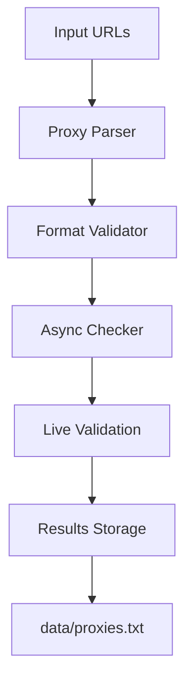

# PCHECKER
<div align="center">  


  
 
   ### Open-source proxy parsing and checking software
 </div>

## 🚀 Features

- **Smart Proxy Parsing** - Automatically extracts proxies from web-sites
- **Multi-Protocol Support** - HTTP, HTTPS, SOCKS5 protocols
- **Async Validation** - High-performance concurrent proxy checking
- **Docker Ready** - Easy deployment with containerization
- **Real-time Results** - Live validation feedback with progress tracking

## 📦 Quick Start

### Docker Deployment

```bash
# Build and launch the container
docker compose build && docker compose up -d

# Monitor the process
docker compose logs -f

# Check results
docker compose exec proxy_checker cat data/proxies.txt
```

### Traditional Installation

```bash
# Clone repository
git clone https://github.com/aeemao/pchecker.git
cd pchecker

# Install dependencies
pip install -r requirements.txt

# Run the application
python main.py
```

## 📋 Prerequisites

- Python 3.8+ or Docker
- Source URLs with proxy lists

## 🔧 Configuration

### Input Format
Place your proxy source URLs in `data/links.txt` (one per line):

```
https://raw.githubusercontent.com/user1/proxy-list/main/proxies.txt
https://api.example.com/proxy-list
http://proxy-source.com/list.txt
```

### Supported Proxy Formats
The software automatically handles:
- **Full format**: `protocol://ip:port`
- **Short format**: `ip:port` (auto-converted to HTTP)

### Example Sources
Find free proxy lists on GitHub:
```text
https://github.com/search?q=free+proxy&type=repositories
```

## 🏗️ Architecture


## 📊 Output

Validated proxies are saved in `data/proxies.txt` with format:
```
http://192.168.1.1:8080
socks5://10.0.0.1:1080
https://proxy.example.com:3128
```
## 📝 License

This project is licensed under the MIT License - see the [LICENSE](LICENSE) file for details.

## 🤝 Support

- **Issues**: [GitHub Issues](https://github.com/aeemao/pchecker/issues)
- **Discussions**: [GitHub Discussions](https://github.com/aeemao/pchecker/discussions)
- **Documentation**: [Wiki](https://github.com/aeemao/pchecker/wiki)

## ⭐ Acknowledgments

- Built with `httpx` for async HTTP requests
- Containerized with Docker for easy deployment
- Community-driven proxy sources
